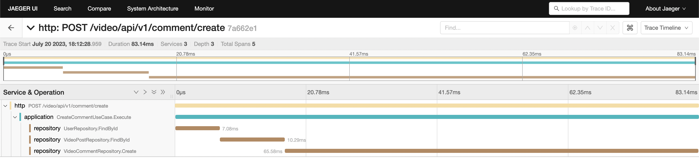

# Golang乾淨架構實踐 (文件還在寫...)

Go和其他語言相比，在專案架構上並無限制，但是在實際開發中，我們還是需要一個規範，讓專案的架構更加清晰，便於維護和擴展。此範例會以
乾淨架構(Clean Architecture)為基礎，並且帶入領域驅動開發(Domain Driven Design)的概念來組織專案。  

乾淨架構能帶來以下好處：
- 易於閱讀的代碼
- 提高可測試性
- 低代碼耦合度
- 團隊協作友好，不互相干擾

範例中使用了以下資料庫來表現資料存取層的彈性:
- [Postgres](https://hub.docker.com/_/postgres)
- [MongoDB](https://hub.docker.com/_/mongo)
- [Neo4j](https://hub.docker.com/_/neo4j)

其中也使用[OpenTelemetry](https://opentelemetry.io/docs/instrumentation/go/getting-started/)和[Jaeger](https://www.jaegertracing.io/)增加可觀測性。

# 環境設置
- 安裝[Go](https://golang.org/doc/install)
- 安裝[FFmpeg](https://ffmpeg.org/download.html)，此專案會使用到FFmpeg來處理影片上傳轉檔案
```shell
# 檢查是否成功安裝
$ ffmpeg -version

ffmpeg version 6.0 Copyright (c) 2000-2023 the FFmpeg developers
built with Apple clang version 14.0.0 (clang-1400.0.29.202)
configuration: --prefix=/opt/homebrew/Cellar/ffmpeg/6.0 --enable-shared --enable-pthreads --enable-version3 --cc=clang --host-cflags= --host-ldflags= --enable-ffplay --enable-gnutls --enable-gpl --enable-libaom --enable-libaribb24 --enable-libbluray --enable-libdav1d --enable-libmp3lame --enable-libopus --enable-librav1e --enable-librist --enable-librubberband --enable-libsnappy --enable-libsrt --enable-libsvtav1 --enable-libtesseract --enable-libtheora --enable-libvidstab --enable-libvmaf --enable-libvorbis --enable-libvpx --enable-libwebp --enable-libx264 --enable-libx265 --enable-libxml2 --enable-libxvid --enable-lzma --enable-libfontconfig --enable-libfreetype --enable-frei0r --enable-libass --enable-libopencore-amrnb --enable-libopencore-amrwb --enable-libopenjpeg --enable-libspeex --enable-libsoxr --enable-libzmq --enable-libzimg --disable-libjack --disable-indev=jack --enable-videotoolbox --enable-audiotoolbox --enable-neon
libavutil      58.  2.100 / 58.  2.100
libavcodec     60.  3.100 / 60.  3.100
libavformat    60.  3.100 / 60.  3.100
libavdevice    60.  1.100 / 60.  1.100
libavfilter     9.  3.100 /  9.  3.100
libswscale      7.  1.100 /  7.  1.100
libswresample   4. 10.100 /  4. 10.100
libpostproc    57.  1.100 / 57.  1.100
```
- 安裝[Docker](https://www.docker.com/products/docker-desktop/)，使用Docker Compose搭建環境(Postgres, MongoDB...)

# 啟動專案
執行終端指令
```shell
make run
```
或是
```shell
docker-compose up -d
go run main.go
```

# 乾淨架構主要概念


乾淨架構主要分為三層，依序由核心到外部為Domain Layer、Application Layer、Adapter Layer。每層之間皆以介面(Interface)
做依賴注入(Dependency Injection)， 來達成解耦。

## Domain Layer
Domain Layer是專案的核心，主要負責專案的業務邏輯，並且不依賴任何外部服務，例如資料庫、HTTP等等。通常以Entity、Aggregate組成。
## Application Layer
Application Layer是Domain Layer的橋樑，負責將Domain Layer的業務邏輯透過Interface暴露外部。通常以UseCase、Repository(Interface)組成。
## Adapter Layer
Adapter Layer負責將外部的請求轉換成Application Layer的輸入(e.g. HTTP, gRPC等請求)，或將Application Layer的輸出轉換成外部的輸出(e.g. 存取資料庫, 請求外部服務)。

# 資料夾結構
```text
.
├── .
├── ├── adapter # 對應Adapter Layer
├── │   ├── port_i # 外部輸入(ingress)
├── │   │   └── http
├── │   │       ├── route
├── │   │       └── router.go
├── │   └── port_out # 內部輸出(egress)
├── │       └── repository
├── ├── config
├── │   └── app_config.yaml
├── ├── docker-compose.yml
├── ├── docs
├── ├── internal
├── │   ├── context # 以不同限界上下文(Bounded Context)做package拆分，商業邏輯會存在於各package
├── │   │   │── auth (驗證領域)
│   │   │   └── media (媒體領域)
├── │   │       ├── comment (sub-domain) # 每個限界上下文包含不同sub-domain
├── │   │       └── video (sub-domain)
├── │   ├── entity # 對應Entity
├── │   ├── aggregate # 對應Aggregate
├── │   ├── vo # 對應 Value Object
├── │   ├── repository # 對應Application Layer的Repository，只存放介面(Interface)
├── │   └── exception
├── ├── go.mod
├── ├── go.sum
├── ├── main.go # 進入點
├── ├── migration # 資料庫版控，可以分開獨立於其他Git Repository
├── ├── mocks # 存檔Mockery產生的mock檔案
├── ├── pkg # 調用外部套件會放在/pkg下
├── ├── Makefile
└── └── scripts
```

## Entity
宣告一個Entity並不需要完全按照Database的Schema來設計，而是以業務邏輯為主，並且不依賴任何外部服務。以下為一個User Entity的範例。
```go
type User struct {
	Id        uint                 `json:"id"`
	Roles     []Role               `json:"roles" gorm:"many2many:user_roles"`
	Username  string               `json:"username"`
	Password  vo.EncryptedPassword `json:"password"`
	Email     vo.Email             `json:"email"`
	CreatedAt time.Time            `json:"created_at,omitempty"`
	UpdatedAt time.Time            `json:"updated_at,omitempty"`
	DeletedAt sql.NullTime         `json:"deleted_at,omitempty"`
}

// 務必創建一個Constructor function.
func NewUser(username string, password vo.EncryptedPassword, email vo.Email, roles ...Role) *User {
	return &User{
		Roles:    roles,
		Username: username,
		Password: password,
		Email:    email,
	}
}

```

## Application Layer 應依賴於 Repository Interface
Application Layer的UseCase應該依賴於Repository Interface，而不是Adapter Layer中Repository的實作。如此才能達到解耦的效果，並且可以
輕易替換Repository實作(e.g. MySQL替換為Postgres)。且可以在沒有Database的情況下，先開發出Application Layer的商業邏輯。
再做Unit Test時針對Repository Interface做Mock即可，不需要真的連接到資料庫。
```go
type VideoCommentRepository interface {
    Create(ctx context.Context, comment *entity.VideoComment) error
    FindByVideoId(ctx context.Context, videoId uint) ([]*entity.VideoComment, error)
    FindById(ctx context.Context, id primitive.ObjectID) (*entity.VideoComment, error)
    DeleteById(ctx context.Context, id primitive.ObjectID, deleterId uint) (int, error)
    ForceDeleteById(ctx context.Context, id primitive.ObjectID) (int, error)
}
```

## 讀寫分離模式(CQRS)拆分UseCase
將寫入與讀取的行為拆分為獨立的UseCase，藉此維持函式呼叫的冪等性，避免意外的副作用，同時提升寫入和讀取的效率。  

一個有寫入行為的UseCase會以此方式宣告，`xxx`則為該UseCase的行為名稱(e.g. Login, CreateProduct...)
```go
package subdomain

type xxxCommand struct {
    ParameterA uint
    RandomEntity  eneity.RandomEntity
}

type xxxResponse struct {
	
}

type IxxxUseCase interface {
    Execute(ctx context.Context, cmd xxxCommand) (*xxxResponse, error)
}

type xxxUseCase struct {
    RandomEntityRepository repository.RandomEntityRepository // 請宣告為介面！
}

func NewxxxUseCase(randomEntityRepository repository.RandomEntityRepository) *xxxUseCase {
    return &xxxUseCase{
        RandomEntityRepository: randomEntityRepository,
    }
}

func (uc xxxUseCase) Execute(ctx context.Context, cmd xxxCommand) (*xxxResponse, error) {
    err := uc.RandomEntityRepository.Create(cmd.RandomEntity)
    if err != nil {
        return nil, err
    }
	
    return &xxxResponse{}, nil
}
```
若為讀取行為的UseCase則將`xxxCommand`改為`xxxQuery`，表達執行一個讀取操作。

## DTO 該放在哪？
若DTO與UseCase的Command欄位完全相同，則可不必轉換，直接將Command當作DTO使用，直接將Application Layer與Adapter Layer耦合，避免代碼冗余。
若需要建立則在internal/dto下建立，供Adapter Layer使用。
```go
func (c CommentController) Create(ctx *gin.Context) {
    newCtx, span := tracing.HttpSpanFactory(c.TracerProvider, ctx, pkg)
    defer span.End()

    token, exists := ctx.Get("token")
    if !exists {
        ctx.JSON(http.StatusUnauthorized, res.Fail(exception.ErrUnauthorized.Error(), nil))
        tracing.RecordHttpError(span, http.StatusUnauthorized, exception.ErrUnauthorized)
        return
    }

    cmd := comment.CreateCommentCommand{
        AuthorId: token.(*jwt.CustomClaim).Uid,
    }
    err := ctx.ShouldBindJSON(&cmd)
    if err != nil {
        ctx.JSON(http.StatusBadRequest, res.Fail(err.Error(), "invalid request body."))
        tracing.RecordHttpError(span, http.StatusUnauthorized, err)
        return
    }

    response, err := c.CreateUseCase.Execute(newCtx, cmd)
    if err != nil {
        ctx.JSON(http.StatusInternalServerError, res.Fail(err.Error(), "unable to create comment."))
        tracing.RecordHttpError(span, http.StatusInternalServerError, err)
        return
    }

    ctx.JSON(http.StatusCreated, res.Success(response))
}
```

## 可觀測性

OpenTelemetry是由`context.Context`的傳播機制來做鏈路追蹤，因此在每層架構中應將`context.Context`傳遞下去，使後續開發以及運維單位能夠輕易的追蹤到
每個請求的狀態。  
***無論當前是否有使用可觀測性工具，建議都在每層函式呼叫的第一個參數加上`context.Context`，並且在每層函式呼叫時將context.Context傳遞下去。
避免未來需要加入可觀測性工具時，需要大量的修改代碼。***

範例 1. Use Case
```go
type IxxxUseCase interface {
    Execute(ctx context.Context, cmd xxxCommand) (*xxxResponse, error)
}
```

範例 2. Repository
```go
type UserRepository interface {
    Create(ctx context.Context, user *entity.User) error
    FindByUsername(ctx context.Context, username string) (*entity.User, error)
    FindById(ctx context.Context, id uint) (*entity.User, error)
}
```

## 組件之間應依賴於介面
組件之間應依賴於介面，而不是實作。如此才能避免耦合。

